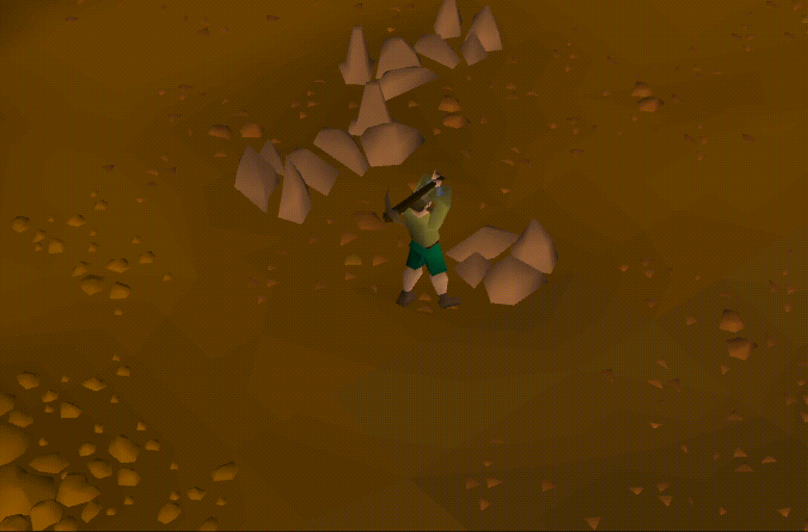

# Logan Website
## Introduction

Welcome to my website, there's currently nothing here but this will soon be
updated with all kinds of cool an interesting information once I get my hands on
it.

Alright I changed it back to markdown why do I keep thinking it's a good idea to
use html...

## Table of Contents

- [leetcode](./leetcode/problems)

<!-- Load the Twitch embed JavaScript file -->

<!-- Create a Twitch.Embed object that will render within the "twitch-embed" element -->

